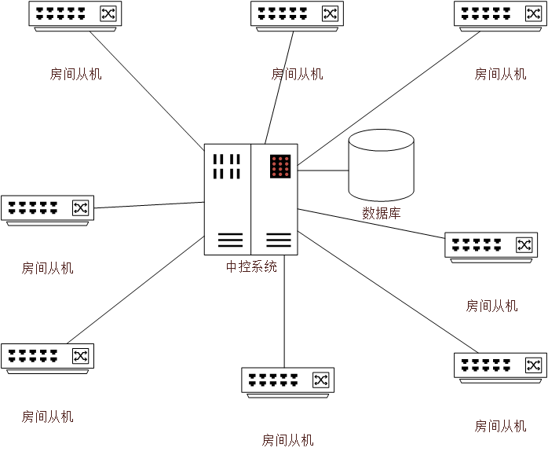

# 分布式温控系统的解决方案

## 1.项目背景

某快捷廉价酒店响应节能绿色环保理念，推行自助计费式中央温控系统。入住的客户可以根据需求设定温度和调节风速，同时房间内的终端可以显示所需支付的金额。客户退房时酒店须出具空调使用的账单及详单。空调运行期间，空调管理员能够监控各房间空调的使用状态，需要的情况下可以生成格式统计报表。

## 2.项目目标

对于中控系统：

1. 可以处理各从控提出的开关机、调节温度、调节风速等请求。
2. 可以调节处于自动模式的从控的风速。
3. 在处理从控请求时体现调度过程（由于最多能同时处理三个从控的请求）。
4. 可以实时监控各从控空调的当前风速、设定温度以及房间实际温度。
5. 可以计算各从控产生的使用费用。
6. 可以生成各从控的账单、使用详单、费用报表。

对于从控空调：

1. 可以向主控提出开关机、调节温度、调节风速等请求。
2. 可以设定空调运行模式。
3. 可以实时显示当前已产生的费用。

## 3.需求分析

### 3.1 功能需求

| 编号 | 需求                           | 描述                                                         |
| ---- | ------------------------------ | ------------------------------------------------------------ |
| 1    | 房间从机启动                   | 连接中控系统，获取配置参数                                   |
| 2    | 房间从机设定模式               | 可设置运行模式为：制冷、制热、自动                           |
| 3    | 房间从机设定温度               | 制冷模式下，可设定温度范围为：16-28度制热模式下，可设定温度范围为：24-30度 |
| 4    | 房间从机设定风速               | 可设定风速为：自动、0-5级                                    |
| 5    | 房间终端显示实时费用           | 实时显示当前已产生的费用                                     |
| 6    | 房间从机关机                   | 上报中控系统，结束计费                                       |
| 7    | 主机启动                       | 初始化，等待从机连接                                         |
| 8    | 主机响应从机连接               | 发送配置参数                                                 |
| 9    | 主机监控从机状态               | 实时显示各从机状态：运行情况、模式、风速、设定温度、实际温度 |
| 10   | 主机处理从机温度设定请求       | 判断是否允许设定温度，响应从机请求                           |
| 11   | 主机处理从机风速设定请求       | 判断是否允许设定风速，响应从机请求                           |
| 12   | 主机生成各房间从机的账单和详单 | 房间从机关机结算时生成账单和详单                             |
| 13   | 主机生成各房间从机的报表       | 所有从机的开机、使用情况、费用报表                           |

### 3.2 安全需求

1. 房间从机与主机的通信建立时应当采用一定的手段进行认证
2. 中控系统应当对权限进行划分和管理，仅允许管理员操作中控系统，且不同权限级别的管理员所能进行的操作应当不同

### 3.3 非业务需求

1. 房间从机的界面应当简洁、清晰、易于使用
2. 中控系统展示统计报表的界面应当清楚、明了，应当支持统计报表的导出或下载

## 4.技术架构设计

### 4.1 总体逻辑结构

整个系统分为主机（中控系统）和各房间的从机，主机和从机之间采用星型拓扑网络进行互联：

### 4.2 软件方案

考虑到业务需求、开发的复杂度和多平台兼容，我们决定采用B/S架构进行开发。

前端采用的方案为Vue或React等框架。

后端采用Django。

数据库采用MySQL。

### 4.3 网络方案

由于主机和房间从机之间需要进行双工通信，在我们采用B/S架构的前提下，HTTP协议不具备主机主动向客户端发送消息的能力，故我们决定采用Websocket协议。

### 4.4 部署方案

软件的部署环境为Ubuntu 16.04LTS，生产服务器选用Apache。

## 5.实施方案

### 5.1 人员配置

团队共有5名成员，服务端（中控系统）和客户端（房间从机）分别由2名同学负责开发，另外一名同学作为机动和测试，视开发进度随时调整

### 5.2 软件开发过程

考虑到软件需求的不确定性和对相对较高的开发效率的要求，我们决定采用喷泉模型，从而实现迭代开发，且能够对开发过程进行规范的管理、提高开发效率

### 5.3 版本控制

为便于开发过程中团队成员的协作和版本管理，我们决定采用Git进行版本控制。